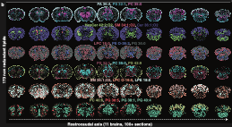
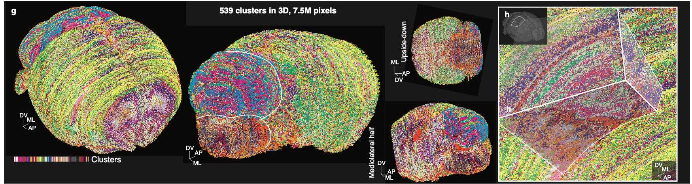

# Lipid Brain Atlas Explorer 

<!-- <p align="center"></p>

## Overview

Lipids account for the majority of the brain dry weight. They form the cell membranes that constitute myelin, axons, dendrites, and synapses and enclose intracellular organelles and neurotransmitter-laden vesicles. Seminal studies have examined the lipid composition of the mammalian brain across anatomical structures, but a systematic survey of the brain lipid metabolic architecture in relation to cell type composition, subcellular organization, functional anatomy, developmental origin, and connectivity was lacking. 

That's why we constructed the Lipid Brain Atlas - we mapped the distribution of 172 lipids at quasi-cellular spatial resolution across brain sections from 11 mice of 8 weeks of age, covering the entire brain volume. To do so, we used matrix-assisted laser desorption/ionization mass spectrometry imaging (MALDI-MSI), a technique capable to ionize a micrometic portion of the tissue and resolve for it a mass spectrum rich in lipids. 

We identified 539 lipidome-defined brain clusters, which we termed lipizones. We characterized lipizones in relation to anatomy, cell type composition, cell compartments, connectivity, and biochemistry, revealing their biological organization and potential functional relevance. We compared male and female brains; finally, to explore how lipids vary in physiology, we charted the spatial lipidome in the brain of pregnant mice. You can read the full manuscript on biorXiv: xxx.

With this interactive explorer, you can surf the lipidomic architecture of the mouse brain. You can look at the 172 annotated lipids (up to three simultaneously, in RGB), one section at a time along the rostrocaudal axis, or all sections together, for each of the 11 mice, zooming in and moving around. You can also overlay the Allen Brain annotations. Similarly, you can explore all the raw m/z peaks in space, across sections and brains, and the "lipid programs" that we extracted with our lipiMap model, and the NMF embeddings that we used for clustering. You can perform differential analysis, comparing Allen Brain regions or drawing your own regions, exploring the results with volcano plots colored by lipid class. You can discover the lipizones, moving around their hierarchy with a convenient treemap, again with single-section and multi-section views, across all brains, selecting flexibly a subset of lipizones of your interest. You can also download the "ID cards" of the lipizones, which show some preliminary information on their content and distribution. You can also compare the lipizones with the cell types from Langlieb et al. 2023 (this section of the website is currently work in progress), or the lipids and the full imputed transcriptomes based on the same study. Finally, you can explore regional lipidomes in 3D, as well as lipizones (along their hierarchy) in 3D. Soon you will be able to download data directly from the visualizations in this website, but as we interpolated and cleaned for visualization, we recommend exploring the full dataset available on Zenodo, starting from the tutorials available on the Github repository accompanying this study.

We hope that this data will help you investigate the lipid architecture of the healthy mouse brain and its changes in physiological settings, towards functional studies of brain lipids in evolution, pathology, and drug response. We would be very happy to hear from you should you have any feedback or question, you can email us at luca.fusarbassini@epfl.ch.

The Lipid Brain Atlas Explorer is a Python Dash web-application developped as part of the **Lipid Brain Atlas project**, led by the [Lipid Cell Biology lab (EPFL)](https://www.epfl.ch/labs/dangelo-lab/) and the [Laboratory of Brain Development and Biological Data Science (EPFL)](https://www.epfl.ch/labs/nsbl/). We hope that this application will be of great help to query the Lipid Brain Atlas to guide your hypotheses and experiments, and more generally to achieve a better understanding of the cellular mechanisms involving lipids that are fundamental for nervous system development and function. -->

## Welcome to the Lipid Brain Atlas Explorer

<p align="center">
  
</p>

**Lipids make up the majority of the brain’s dry weight.** They form the membranes of cells and subcellular compartments: from myelin to axons, dendrites, synapses, intracellular organelles, and neurotransmitter-laden vesicles. While foundational studies have explored lipid composition across mammalian brain regions, a **systematic mapping of the brain’s lipid metabolic architecture**—in relation to cell type, subcellular structure, functional anatomy, developmental origin, and connectivity—has long been missing.

That’s why we built the **Lipid Brain Atlas**.

Using **matrix-assisted laser desorption/ionization mass spectrometry imaging (MALDI-MSI)**—a technique that ionizes micrometric portions of tissue and provides lipid-rich mass spectra—we mapped the spatial distribution of **172 lipids** at **quasi-cellular resolution**, across serial brain sections from **11 mice** (8 weeks old), covering the **entire brain volume**.
<p align="center">
  
</p>

Through this, we identified **539 spatial clusters** defined by lipidomic similarity—territories we termed **lipizones**. These lipizones were then characterized in terms of anatomy, cell type composition, subcellular organization, connectivity, and biochemical content, revealing their biological organization and potential functional roles. We also compared male and female brains, and extended our study to **pregnant mice** to capture physiological lipidomic variation.
<p align="center">
  
</p>

You can read the full manuscript on bioRxiv: `XXX`.

---

## Explore the Atlas

This **interactive web explorer** enables you to browse and analyze the mouse brain lipidome in a dynamic, intuitive way:

* Visualize **up to three annotated lipids** simultaneously (mapped to RGB), either one brain section at a time along the **rostrocaudal axis** or all sections at once.
* Switch between brains from different **biological conditions**, including all **11 mice**.
* Overlay anatomical annotations from the **Allen Brain Atlas** for spatial context.
* Inspect the full set of **raw m/z peaks**, across all slices and brains.
* Explore **Lipid Programs**, computed using our deep learning model **LipiMap**, which groups lipids into biologically meaningful modules.
* View **NMF embeddings** used to extract these programs and drive clustering.
* Run **differential analyses** between brain regions—either anatomically defined or manually drawn—and visualize results with **volcano plots** highlighting statistically significant lipid differences.
* Discover and navigate **lipizones** via a hierarchical treemap. View them in single slices or across all sections, in any of the 11 brains. You can also download their **ID Cards**, which summarize key features of each lipizone.
* Compare **lipizones** with **cell types** from **Langlieb et al. (2023)** (currently in development), or compare **lipid distributions with gene expression** from the same study’s imputed transcriptomic data.
* Explore **3D reconstructions** of both lipid expressions and lipizones, rendered across the full brain volume.

---

## Data Access and Reuse

Soon, you’ll be able to **download data directly** from the visualizations in this interface. However, since some data is interpolated and cleaned for display, we encourage users to explore the **full raw dataset** available on **Zenodo**, starting with the tutorials and code in the accompanying [GitHub repository](https://github.com/lamanno-epfl/EUCLID).

---

## About the Project

The **Lipid Brain Atlas Explorer** is a **Python Dash** web application developed as part of the **Lipid Brain Atlas project**, led by the
[**Lipid Cell Biology Lab (EPFL)**](https://www.epfl.ch/labs/dangelo-lab/) and the
[**Laboratory of Brain Development and Biological Data Science (EPFL)**](https://www.epfl.ch/labs/nsbl/).

We hope this tool will help you explore the **Lipid Brain Atlas**, guiding your experiments and hypotheses toward a deeper understanding of the **cellular and metabolic foundations** of nervous system development and function. By supporting your investigation into the **lipid architecture of the healthy mouse brain** and its **variability across physiological conditions**, we aim to contribute to **functional studies of brain lipids**—spanning **evolution**, **pathology**, and **therapeutic response**.

For feedback or questions, please reach out to us at **[luca.fusarbassini@epfl.ch](mailto:luca.fusarbassini@epfl.ch)**.

---

**Lausanne, 03/06/2025**
*Francesca Venturi, Luca Fusar Bassini, Halima Hannah Schede, Colas Droin*

<!-- ## Use and deployment

The app is compatible with Python 3.8 and is guaranteed to work until version 3.12.9. 

Required packages can be installed with: 

```pip install -r requirements.txt```

Warning: The Dash version version MUST BE <=2.5.1, otherwise, bug may be present with long_callbacks.

The app can be run locally using the command:

```python main.py```

The app can be deployed on a server with Gunicorn (here with 4 threads and only 1 worker to avoid using too much RAM):

```gunicorn main:server -b:8077 --worker-class gevent --threads 4 --workers=1```

In both cases, it will be accesible with a browser at http://localhost:8100. -->

<!-- ## Technical documentation

The technical documentation of the app is available [here](https://lbae-doc.epfl.ch/). -->

## Citing

If this app has been useful to your research work, you can cite our paper: `XXX`.

## About

The early version of the app (frontend and backend) was developed by Colas Droin under the supervision of Gioele La Manno and Giovanni d'Angelo, as part of the Lipid Brain Atlas project. The final version was updated and further developed by Francesca Venturi and Luca Fusar Bassini.
