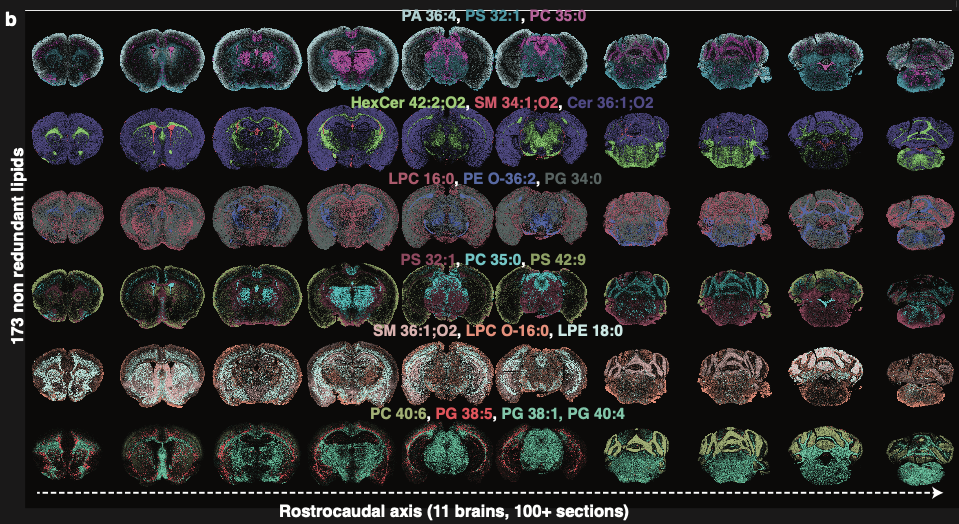

# Lipid Brain Atlas Explorer documentation 

---
### Overview

**Lipids make up the majority of the brain’s dry weight.** They form the membranes of cells and subcellular compartments: from myelin to axons, dendrites, synapses, intracellular organelles, and neurotransmitter-laden vesicles. While foundational studies have explored lipid composition across mammalian brain regions, a **systematic mapping of the brain’s lipid metabolic architecture**—in relation to cell type, subcellular structure, functional anatomy, developmental origin, and connectivity—has long been missing.

That’s why we built the **Lipid Brain Atlas**.

Using **matrix-assisted laser desorption/ionization mass spectrometry imaging (MALDI-MSI)**—a technique that ionizes micrometric portions of tissue and provides lipid-rich mass spectra—we mapped the spatial distribution of **172 lipids** at **quasi-cellular resolution**, across serial brain sections from **11 mice** (8 weeks old), covering the **entire brain volume**.

Through this, we identified **539 spatial clusters** defined by lipidomic similarity—territories we termed **lipizones**. These lipizones were then characterized in terms of anatomy, cell type composition, subcellular organization, connectivity, and biochemical content, revealing their biological organization and potential functional roles. We also compared male and female brains, and extended our study to **pregnant mice** to capture physiological lipidomic variation.

You can read the full manuscript on bioRxiv: https://www.biorxiv.org/cgi/content/short/2025.10.13.682018v1.

### Explore the Atlas

This **interactive web explorer** enables you to browse and analyze the mouse brain lipidome in a dynamic, intuitive way:

* Visualize **up to three annotated lipids** simultaneously (mapped to RGB), either one brain section at a time along the **rostrocaudal axis** or all sections at once.
* Switch between brains from different **biological conditions**, including all **11 mice**.
* Overlay anatomical annotations from the **Allen Brain Atlas** for spatial context.
* Inspect the full set of **raw m/z peaks**, across all slices and brains.
* Explore **Lipid Programs**, computed using our deep learning model **LipiMap**, which groups lipids into biologically meaningful modules.
* View **NMF embeddings** used to extract these programs and drive clustering.
* Run **differential analyses** between brain regions—either anatomically defined or manually drawn—and visualize results with **volcano plots** highlighting statistically significant lipid differences.
* Discover and navigate **lipizones** via a hierarchical treemap. View them in single slices or across all sections, in any of the 11 brains. You can also download their **ID Cards**, which summarize key features of each lipizone.
* Compare **lipizones** with **cell types** from **Langlieb et al. (2023)** (currently in development), or compare **lipid distributions with gene expression** from the same study’s imputed transcriptomic data.
* Explore **3D reconstructions** of both lipid expressions and lipizones, rendered across the full brain volume.

### Data Access and Reuse

Soon, you’ll be able to **download data directly** from the visualizations in this interface. However, since some data is interpolated and cleaned for display, we encourage users to explore the **full raw dataset** available on **Zenodo**, starting with the tutorials and code in the accompanying [GitHub repository](https://github.com/lamanno-epfl/EUCLID).

### Usage 

You will be guided through the app thanks to popover tutorial, we hope you enjoy them!

### About the Project

The **Lipid Brain Atlas Explorer** is a **Python Dash** web application developed as part of the **Lipid Brain Atlas project**, led by the [**Lipid Cell Biology Lab (EPFL)**](https://www.epfl.ch/labs/dangelo-lab/) and the [**Laboratory of Brain Development and Biological Data Science (EPFL)**](https://www.epfl.ch/labs/nsbl/).

We hope this tool will help you explore the **Lipid Brain Atlas**, guiding your experiments and hypotheses toward a deeper understanding of the **cellular and metabolic foundations** of nervous system development and function. By supporting your investigation into the **lipid architecture of the healthy mouse brain** and its **variability across physiological conditions**, we aim to contribute to **functional studies of brain lipids**—spanning **evolution**, **pathology**, and **therapeutic response**.

The early version of the app (frontend and backend) was developed by Colas Droin under the supervision of Gioele La Manno and Giovanni d'Angelo, as part of the Lipid Brain Atlas project. The final version was updated and further developed by Francesca Venturi and Luca Fusar Bassini.

For feedback or questions, please reach out to us at **[luca.fusarbassini@epfl.ch](mailto:luca.fusarbassini@epfl.ch)**.

*Lausanne 12.06.2025*

*Francesca Venturi, Luca Fusar Bassini, Halima Hannah Schede and Colas Droin*

_

## Citing

If this app has been useful to your research work, you can cite our paper: https://www.biorxiv.org/cgi/content/short/2025.10.13.682018v1.

